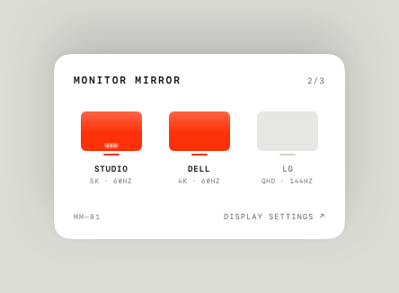

# Monitor Mirror

A tiny macOS menu bar app for Macs with several external displays. Click the monitor glyph
in the menu bar and a minimal popover shows every connected display side by side — click one
to switch it **genuinely off** (dark, not just dimmed), click again to switch it back on,
and right-click to hand it the menu bar. Built natively in Swift + AppKit + SwiftUI.

<p align="center">
  
</p>

## Features

- **Turn a display truly off** — the panel goes dark and drops off the bus, not a mirror
  trick. It comes back exactly where it was, and the state survives a reboot.
- **Set the main display** — right-click any monitor to move the menu bar and Dock to it.
  The main display is marked with a tiny dock badge on its glyph.
- **A live status readout in the menu bar** — the icon is a monitor frame with one segment
  per display: solid for on, faint for off.
- **Menu-bar-only** — no Dock icon, no window clutter. Universal binary (Apple silicon +
  Intel), no dependencies.

<p align="center">
  
</p>

## Install

```bash
./scripts/build-app.sh --install
```

This builds a **universal** `Monitor Mirror.app`, ad-hoc signs it so it launches without a
developer account, copies it to `/Applications`, and opens it. Look for the monitor glyph in
the menu bar. Leave off `--install` to build into `build/` without touching `/Applications`.

**Requirements:** macOS 13 (Ventura) or later; an Xcode / Swift 6 toolchain to build.

## Usage

| Action | What it does |
|--------|--------------|
| **Left-click** the glyph | Open / close the popover |
| **Click a display** | Switch it off or on |
| **Right-click a display** | Make it the main display (menu bar + Dock move to it) |
| **DISPLAY SETTINGS ↗** | Open System Settings → Displays |
| **Right-click the glyph** | *Turn All Displays On*, *Open at Login*, *Copy Diagnostics*, *Quit* |

Safety rails: the last lit display can never be switched off, and while the screen is locked
macOS refuses display changes — the app detects that and says so instead of stalling.

## How it works

**Turning a display off.** There is no public API that genuinely powers a display down —
`CGConfigureDisplayMirrorOfDisplay` only hides one behind a mirror. The real capability is
`SLSConfigureDisplayEnabled` in the private **SkyLight** framework, which the app resolves at
runtime with `dlsym`. If that symbol is ever dropped or renamed by a future macOS, the app
automatically falls back to mirroring, so it keeps working without an update. Every switch is
**verified**, not assumed: the private call can report success and do nothing, so the
controller polls the real display list until the change is observed, and reports an honest
error otherwise.

Because a hard-off display disappears from the window server entirely, the app keeps a small
**remembered-display registry** so an off display still has a cell to switch back on — even
across relaunches. A display you simply *unplug* (rather than switch off in-app) is forgotten.

**Setting the main display.** The "main" display — the one macOS puts the menu bar and Dock on
— is just the display whose top-left sits at the global origin `(0, 0)`. To hand it to another
screen, the app translates the *whole* arrangement (via the public `CGConfigureDisplayOrigin`)
so the target lands on `(0, 0)`, keeping every display's position relative to its neighbours —
so nothing on the desktop jumps around, only the menu bar moves.

## Architecture

The tricky logic lives in a `MonitorMirrorCore` library with no UI and no direct hardware
dependency, so every edge case is unit-testable against a fake window server.

| File | Responsibility |
|------|----------------|
| `DisplayReducer` | Pure merge of live displays + remembered registry → the list the UI draws. Ordering, disambiguation, retention, safety checks. |
| `DisplayNaming` | Pure formatting: short names (`STUDIO`), specs (`5K · 60HZ`). |
| `DisplayPowerController` | Applies on/off/main to real displays, verifies, degrades hard-off → mirror. |
| `SkyLightBridge` | Runtime `dlsym` lookup of the private enable/disable call. |
| `DisplaySnapshotProviding` | Reads the window server; splits a background-safe (CoreGraphics-only) snapshot from the `NSScreen` one. |
| `DisplayManager` | `@MainActor` state owner: observes hardware changes, applies actions off the main thread, publishes to SwiftUI. |
| `MonitorMirror/*` | Menu bar glyph, borderless popover panel, the SwiftUI card, app wiring. |

## Tests

```bash
swift test                                                          # unit tests, no hardware
MM_HARDWARE_TESTS=1 swift test --filter HardwareIntegrationTests    # switches a real display
```

The unit tests cover naming, the reducer's edge cases (vanishing displays, retention,
identical panels, ordering ties, off-intent authorship) and the manager's full action
lifecycle (optimistic update, rollback on failure, persistence, the locked-session path, the
main-display flip, and the *restore-that-fails-keeps-the-cell* reliability guarantee) against
a fake window server. The hardware tests switch a real secondary display off/on and reassign
main, always restoring the original arrangement — even on failure. They self-skip when the
screen is locked or fewer than two displays are attached.

## Diagnostics

```bash
"/Applications/Monitor Mirror.app/Contents/MacOS/MonitorMirror" --diagnose
```

Prints everything the app can see about the attached displays — the same text the
*Copy Diagnostics* menu item copies to the clipboard.

## Design

Recreated pixel-for-pixel from a Teenage Engineering–inspired design handoff (monospaced
micro-typography, generous whitespace, a single warm orange accent, no borders). The original
spec and interactive prototype are preserved in [`docs/design-reference/`](docs/design-reference).

## License

MIT — see [LICENSE](LICENSE).
